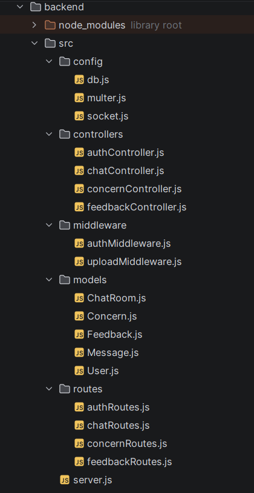

# _Study_Bloom-Help Response_

# **Component Overview** 

 ## Backend Intergration

###Problem Overview
The Study Bloom Help Response System addresses this issue by introducing a centralized platform where users can post concerns through a shared help feed. Unlike traditional systems, any available responder (without requiring a direct request) can proactively accept a concern and provide assistance.

Once a concern is accepted, a private chat channel is established between the requester and the responder. This chat enables real-time communication and supports multiple interaction formats, including text, image uploads, PDF sharing, and voice messages. To manage the lifecycle of each interaction, responders can update the chat status (e.g., active or resolved). When marked appropriately, the chat becomes read-only, preventing further modifications and preserving the conversation for reference.

Additionally, the system ensures accountability and quality of responses through a feedback mechanism. After a chat is closed, the requester is prompted to submit feedback, which is then stored in the responder’s profile. This helps evaluate responder performance and improve the overall reliability of the platform.

----

###  Folder Structure

- **config/**  
  Contains configuration files required for the application.
    - `db.js` – Establishes connection with the MongoDB database
    - `multer.js` – Handles file uploads (images, audio, PDFs, CSV files)
    - `socket.js` – Sets up real-time communication using Socket.IO

- **controllers/**  
  Contains the core business logic of the application.
    - `authController.js` – Handles user authentication (login/register)
    - `chatController.js` – Manages chat functionality (messages, media sharing)
    - `concernController.js` – Handles student concerns (create, accept, manage)
    - `feedbackController.js` – Processes feedback after chat completion

- **middleware/**  
  Includes custom middleware functions used in request processing.
    - `authMiddleware.js` – Secures routes using JWT authentication
    - `uploadMiddleware.js` – Handles file upload requests

- **models/**  
  Defines MongoDB schemas using Mongoose.
    - `User.js` – Stores user details
    - `Concern.js` – Stores help requests
    - `ChatRoom.js` – Manages chat sessions
    - `Message.js` – Stores chat messages (text, files, audio)
    - `Feedback.js` – Stores feedback given to responders

- **routes/**  
  Defines API endpoints and links them to controllers.
    - `authRoutes.js` – Authentication routes
    - `chatRoutes.js` – Chat-related APIs
    - `concernRoutes.js` – Concern management APIs
    - `feedbackRoutes.js` – Feedback APIs

- **server.js**  
  The main entry point of the backend. It initializes the Express server, connects to the database, configures middleware, and registers all routes.

---

## Frontend Intergration
